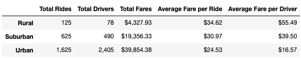
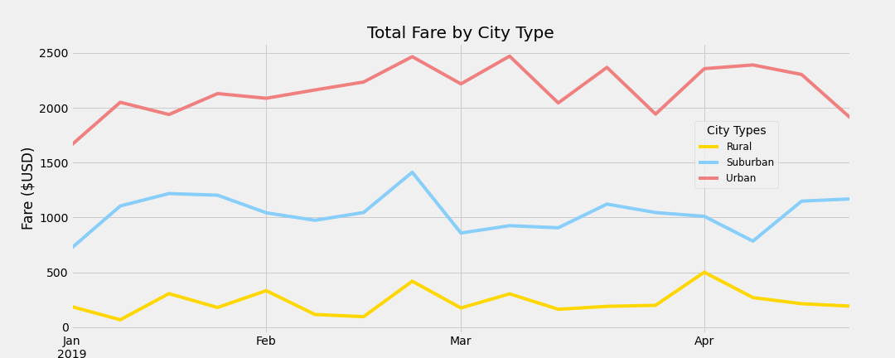

# PyBer_Analysis

## Overview of the analysis:
### The purpose of this analysis is to review the costs associated with utilizing a ride-share service in a rural, suburban and an urban setting. We focus on the amount of drivers and rides and how that correlates into average cost per ride and driver.

## Results: 

### The image above reveals some important information about ride-share in rural, suburban and urban areas.

* Rural drivers make more money per ride.
  * The rural areas have fewer drivers and fewer rides than the other areas.
  * It can be inferred that the average earning per driver is due to the distance traveled in a rural setting.
* Suburban drivers make less per ride compared to rural drivers.
  * The suburban areas performed more rides than the rural and for slightly shorter distances based on average fare per driver.
* Urban drivers make the least per ride compared to rural and suburban drivers.
  * While urban drivers make less per ride, they have an opportunity for more customers than the suburban and rural areas.
  * The difficulty for ride-share operators is that the amount of drivers is larger than the need for rides.

### The data in the chart above compares money earned per day based on the location(rural, suburban or urban).  From the chart we can see that the urban areas make the most amount of money on any given day due to the amount of drivers and rides taken.  This chart also shows the impact of time of year on the amount of money earned.

  
## Summary: 
1. Starting a new ride-share in the city is not very profitable for the driver based on the average per ride earnings.  Another issue is the disparity between rides needed and the amount of drivers available.  The market currently has more drivers than requests for rides.
2. Based on the data, the suburban market would be a likely source for expansion based on the amount of rides to available drivers.  The suburban ride-share driver makes considerably more per ride than their urban counterpart.  There is also more demand than drivers.  It can be inferred that the distances are longer than urban drives and significantly shorter than the rural drives leading to faster turn around to service more riders.
3. Rural areas do not appear to be an area with a real need for the ride-share industry.  While drivers make significantly more than their counterparts, the need for the serivce is much lower.
